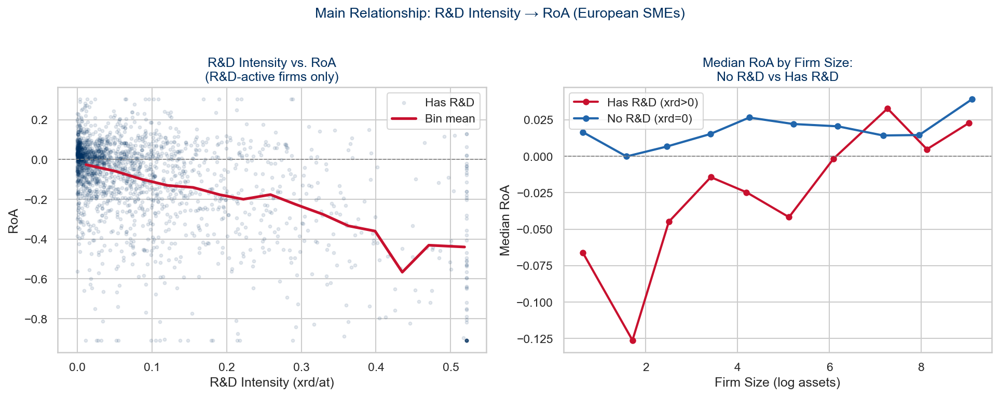
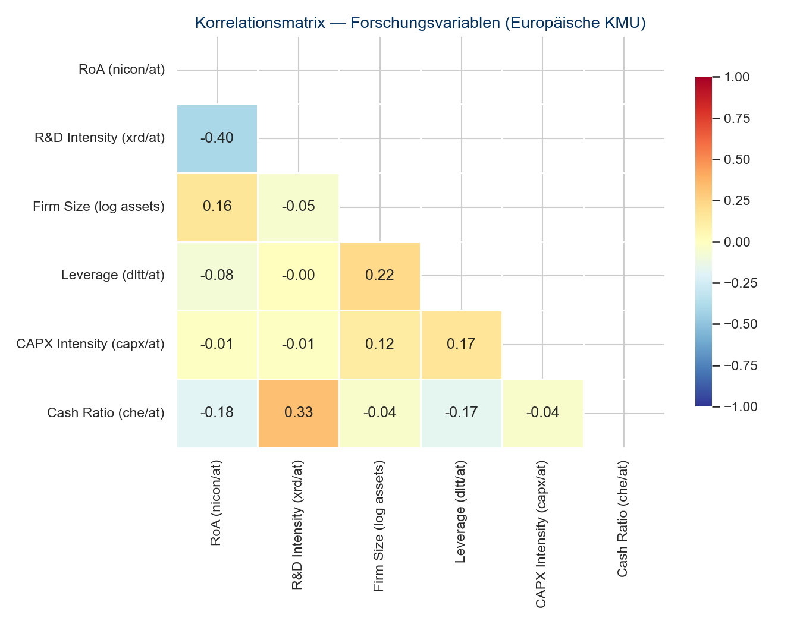

```{python}
#| echo: false
import pandas as pd
import numpy as np

# Loads the fully processed panel produced by code/03_descriptives.py
# (run `python code/03_descriptives.py` first if this file does not exist yet)
df = pd.read_parquet("data/processed/panel_with_vars.parquet")

n_obs = len(df)
n_firms = df["gvkey"].nunique()
rd_share = round((df["rd_intensity"] > 0).mean() * 100, 1)
roa_mean = round(df["roa"].mean(), 3)
roa_median = round(df["roa"].median(), 3)
```

## 1 Introduction

Innovation is widely regarded as a cornerstone of firm competitiveness. The resource-based view (RBV) holds that R&D investment creates unique, difficult-to-imitate resources that translate into sustained competitive advantage [@barneyFirmResourcesSustained1991]. The absorptive capacity literature extends this argument, proposing that firms with higher R&D intensity develop a stronger ability to absorb external knowledge and convert it into performance [@cohenAbsorptiveCapacityNew1990].

This long-run optimism stands in tension with a well-documented short-run regularity. Under International Financial Reporting Standards (IFRS), most R&D expenditure must be expensed immediately rather than capitalized, mechanically reducing reported period income. This tension is particularly pronounced for SMEs, which typically lack the financial slack that large multinationals use to cushion short-term earnings losses [@fazzariFinancingConstraintsCorporate1988].

Prior empirical work documents substantial heterogeneity in the innovation–performance relationship. @rosenbuschInnovationAlwaysBeneficial2011 show in a meta-analysis that the relationship between innovation and performance is positive on average but strongly context-dependent, while @hashiImpactInnovationActivities2013 find that the translation of innovation inputs into performance depends critically on firm capabilities and market conditions.

Two gaps motivate this research note. First, much of the literature linking R&D to performance relies on pooled cross-sectional estimators that conflate unobserved firm heterogeneity with the R&D effect, making it difficult to isolate a causal within-firm relationship [@wooldridgeEconometricAnalysisCross2010]. Second, whether firm size moderates this relationship — as absorptive-capacity arguments would predict, since larger firms can better deploy R&D outputs across broader operations [@cohenAbsorptiveCapacityNew1990] — has received comparatively little systematic attention in SME-specific panel settings.

This research note addresses both gaps using a panel of EUR-reporting European SMEs drawn from Compustat Global over fiscal years 2015–2024. Employing two-way fixed effects (TWFE) estimation, we obtain causal within-firm estimates of the short-run relationship between R&D intensity and performance, and examine whether firm size moderates this relationship.

> **Research question:** How does R&D intensity affect firm performance among European SMEs, and does firm size moderate this relationship?

## 2 Theoretical Background and Hypotheses

### 2.1 Absorptive Capacity (Cohen & Levinthal, 1990)

Firms with higher R&D intensity develop a stronger capacity to absorb external knowledge and convert it into performance [@cohenAbsorptiveCapacityNew1990]. This capacity is built cumulatively: prior R&D investment expands the firm's ability to recognize the value of new external information, assimilate it, and apply it commercially.

### 2.2 Resource-Based View (Barney, 1991)

R&D investment creates unique, difficult-to-imitate resources that translate into sustained competitive advantage [@barneyFirmResourcesSustained1991]. However, the RBV argument concerns primarily the long-run horizon. In the short run, IFRS accounting requires that R&D expenditure be expensed in the period it is incurred, creating a mechanical wedge between accounting performance and actual value creation. Every euro spent on R&D in year $t$ reduces reported RoA in year $t$, while the resulting commercial returns materialize only after a development and commercialization lag.

For European SMEs, this dynamic is amplified by structural resource constraints. Unlike large multinationals, SMEs lack the diversification and financial buffers that shield performance from innovation spending [@fazzariFinancingConstraintsCorporate1988]. @rosenbuschInnovationAlwaysBeneficial2011 document that the innovation–performance relationship is weaker and more variable among smaller firms.

### 2.3 Hypotheses

> **H0:** R&D intensity has no effect, or a positive effect, on firm performance (RoA) among European SMEs.
>
> **H1:** Higher R&D intensity leads to lower firm performance (RoA) among European SMEs (the expensing effect).
>
> *Test: $\beta$(rd_intensity) < 0 and statistically significant*
>
> **H2:** Firm size positively moderates the negative relationship between R&D intensity and performance — the negative effect is weaker for larger SMEs.
>
> *Test: $\beta$(rd_intensity × ln_at) > 0*

@hashiImpactInnovationActivities2013 provide supporting evidence that firm-level capabilities are a key boundary condition of the innovation–performance relationship, lending support to the moderation logic underlying H2.

## 3 Data and Method

### 3.1 Sample

The empirical analysis draws on annual firm-level data from the WRDS Compustat Global database (`comp_global_daily.g_funda`). The sample is restricted to EUR-reporting firms satisfying the EU SME definition (at most 250 employees, or total assets at most EUR 43 million) over fiscal years 2015–2024.

We apply standard data quality filters, requiring strictly positive total assets, sales, and shareholder equity, and require at least three consecutive firm-year observations per firm. The resulting unbalanced panel comprises `{python} f"{n_obs:,}"` firm-years from `{python} f"{n_firms:,}"` unique firms.

### 3.2 Variables

**Dependent variable (Y).** Firm performance is operationalized primarily as Return on Assets (RoA), calculated as net income divided by total assets (`nicon / at`). RoA is preferred over market-based performance measures because the majority of European SMEs in the sample are not consistently covered by analyst estimates or market price data, making an accounting-based measure the more reliable choice for this population.

**Independent variable (X).** R&D intensity is measured as R&D expenditure divided by total assets (`xrd / at`). Firms that do not report R&D are assigned a value of zero, consistent with the interpretation that non-disclosure reflects an absence of formal R&D activity rather than missing data. Around `{python} f"{rd_share}"`% of firm-years report positive R&D expenditure, reflecting the concentration of formal R&D investment among a minority of technologically active SMEs.

**Moderator.** Firm size is the natural logarithm of total assets (`log(at)`), entering the model both as a moderator (via the interaction term) and as a standalone control. The log transformation is applied because total assets are strongly right-skewed across SMEs; the log scale compresses extreme values and better satisfies linear-model assumptions.

**Controls.** The model includes leverage, capital expenditure intensity (`capx / at`), and the cash ratio (`che / at`) as control variables. Leverage captures financial constraints that may independently affect both R&D spending decisions and reported performance. Capital expenditure intensity proxies for general investment activity, distinguishing R&D-specific effects from broader capital intensity. The cash ratio controls for financial slack, which affects a firm's ability to sustain R&D spending without immediately depressing performance. All continuous variables are winsorized at the 1st and 99th percentiles to limit the influence of extreme observations [@wilcoxIntroductionRobustEstimation2012].

| Variable | Field(s) | Formula | Role |
|---|---|---|---|
| RoA | `nicon`, `at` | `nicon / at` | Dependent (Y) |
| R&D Intensity | `xrd`, `at` | `xrd / at` | Independent (X) |
| R&D × Size | — | `xrd/at × log(at)` | H2 interaction |
| Firm Size | `at` | `log(at)` | Moderator + Control |
| Leverage | `dltt`, `at` | `dltt / at` | Control |
| Cash Ratio | `che`, `at` | `che / at` | Control |
| CAPX Intensity | `capx`, `at` | `capx / at` | Control |

: Variable construction {#tbl-vars}

### 3.3 Estimation Strategy

We estimate a two-way fixed effects (TWFE) panel model:

$$
\text{RoA}_{it} = \beta_1 \text{R\&D}_{it} + \beta_2(\text{R\&D} \times \text{Size})_{it} + \gamma X_{it} + \mu_i + \lambda_t + \epsilon_{it}
$$

where $\mu_i$ are firm fixed effects and $\lambda_t$ are year fixed effects. Standard errors are clustered at the firm level following @petersenEstimatingStandardErrors2009. Firm fixed effects are included because unobserved, time-invariant firm characteristics — such as managerial quality, industry niche, or baseline technological orientation — likely correlate with both R&D intensity and performance; omitting them would bias the OLS estimate. Year fixed effects absorb common macroeconomic shocks (e.g., the COVID-19 period) that affect all firms simultaneously, regardless of their R&D activity.

The preference for fixed over random effects is supported by a Hausman-type comparison [@mundlakPoolingTimeSeries1978]: the FE estimator (-0.534) diverges substantially from the RE estimator (-0.777), consistent with correlation between firm-specific unobserved factors and R&D intensity — precisely the scenario in which random effects estimates are inconsistent.

## 4 Results

### 4.1 Descriptive Statistics

```{python}
#| label: tbl-descriptives
#| tbl-cap: "Descriptive statistics. Continuous variables winsorized at the 1st-99th percentiles."

desc = pd.DataFrame({
    "RoA (nicon/at)": df["roa"],
    "R&D Intensity (xrd/at)": df["rd_intensity"],
    "Firm Size (log assets)": df["ln_at"],
    "Leverage (dltt/at)": df["leverage"],
    "CAPX Intensity (capx/at)": df["capx_intensity"],
    "Cash Ratio (che/at)": df["cash_ratio"],
}).describe().T[["count", "mean", "std", "min", "25%", "50%", "75%", "max"]]

desc.round(3)
```

The distribution of RoA shows the left skew typical of SME panel data: a median of `{python} f"{roa_median}"` indicates marginal profitability for the typical firm-year, while a mean of `{python} f"{roa_mean}"` is pulled downward by loss-making firms. R&D intensity has a median of zero — only `{python} f"{rd_share}"`% of firm-years report positive R&D expenditure, consistent with the concentration of formal R&D investment among a minority of technologically active SMEs [@rosenbuschInnovationAlwaysBeneficial2011].

{#fig-rd-roa}

{#fig-corr}

### 4.2 Regression Results

| | (1) OLS | (2) TWFE | (3) TWFE+H2 |
|---|---|---|---|
| rd_intensity | -0.7835*** | -0.5335*** | -0.7067*** |
| rd_x_size | — | — | 0.0597 |
| ln_at | 0.0244*** | 0.0728*** | 0.0710*** |
| leverage | -0.1527*** | -0.1998*** | -0.2002*** |
| capx_intensity | -0.0576 | 0.0750 | 0.0758 |
| cash_ratio | -0.0644*** | 0.1045*** | 0.1040*** |
| Firm FE | No | Yes | Yes |
| Year FE | No | Yes | Yes |
| Clustered SE | No | Yes | Yes |
| N | 5,459 | 5,459 | 5,459 |
| R² | 0.197 | 0.121 | 0.122 |

: Panel regression results. Dependent variable: RoA. Clustered standard errors at the firm level in Models (2)-(3). \* p<0.10, \*\* p<0.05, \*\*\* p<0.01. {#tbl-regression}

**H1 — R&D intensity and RoA.** R&D intensity enters with a negative and significant coefficient across all specifications. The TWFE estimator (Model 2) is $\hat{\beta}_1 = -0.534$ (p < 0.01). H0 is rejected; H1 is supported. The immediate expensing of R&D under IFRS produces an immediate hit to reported profitability [@cohenAbsorptiveCapacityNew1990; @hashiImpactInnovationActivities2013].

The OLS coefficient (-0.784) exceeds the TWFE coefficient in magnitude by 32%, indicating omitted variable bias in the pooled specification. Firm fixed effects remove this confound by relying exclusively on within-firm variation over time [@mundlakPoolingTimeSeries1978].

**H2 — Firm size as moderator.** The interaction term (Model 3) is positive ($\hat{\beta}_2 = 0.060$) but not statistically significant (p = 0.425). H2 is not supported, although the sign is consistent with absorptive-capacity theory — among larger SMEs the negative effect tends to be weaker, but this cannot be established with statistical confidence in this sample [@cohenAbsorptiveCapacityNew1990].

## 5 Discussion and Conclusion

### 5.1 Discussion

The finding that R&D intensity depresses current-period RoA does not imply that R&D destroys value. Rather, it reflects the timing mismatch built into IFRS accounting: SMEs bear the full accounting cost of R&D immediately, while the resulting returns accrue over subsequent periods — the necessary price of building durable, hard-to-imitate resources in the sense of the resource-based view [@barneyFirmResourcesSustained1991; @cohenAbsorptiveCapacityNew1990].

This carries policy implications. If the short-run earnings hit is visible to lenders and investors who rely on accounting ratios, it may create a bias against R&D commitment among SMEs under profitability pressure [@fazzariFinancingConstraintsCorporate1988]. R&D tax credits or innovation subsidies could partially offset this deterrent effect.

### 5.2 Conclusion

This research note examines the short-run effect of R&D intensity on firm performance among European SMEs using `{python} f"{n_obs:,}"` firm-years from `{python} f"{n_firms:,}"` firms over 2015–2024. H0 is rejected and H1 is strongly supported: higher R&D intensity is associated with significantly lower RoA ($\hat{\beta} = -0.534$, p < 0.01), with the effect attenuating by 32% once firm fixed effects are controlled for. H2 is not supported at conventional significance levels.

Three limitations should be noted: measurement error from zero-imputation of non-reporting firms; the 10-year window may not capture the full R&D payoff cycle; and Compustat coverage is skewed toward listed firms, limiting generalizability to private SMEs.

## References

::: {#refs}
:::
